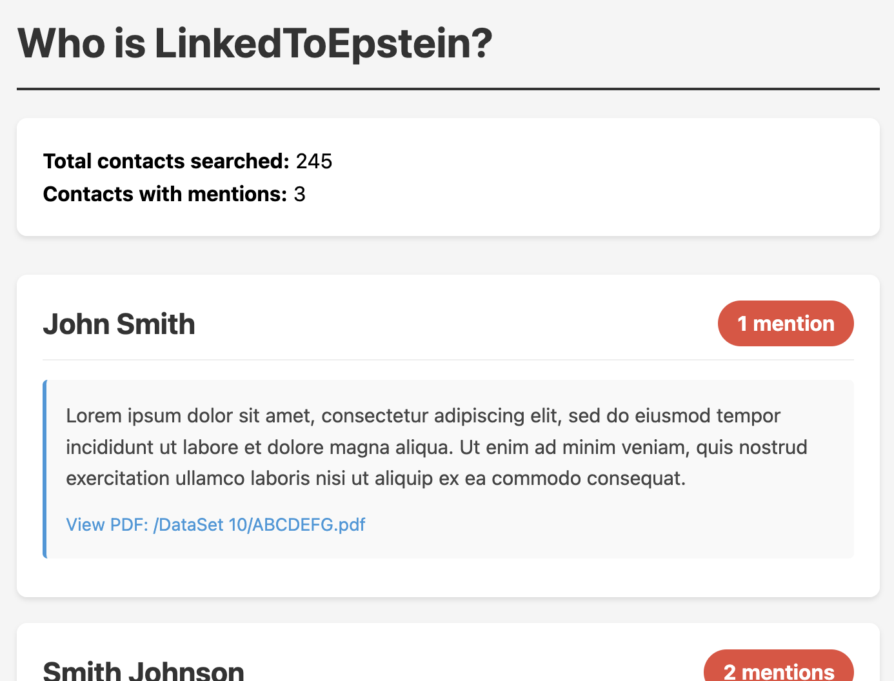

Search the publicly released Epstein court documents for mentions of your LinkedIn connections.

## Requirements

- Python 3.6+
- `requests` library

## Setup

```bash
python3 -m venv project_venv
source project_venv/bin/activate
pip install -r requirements.txt
```

## Getting Your LinkedIn Contacts

1. Go to [linkedin.com](https://www.linkedin.com) and log in
2. Click your profile icon in the top right
3. Select **Settings & Privacy**
4. Click **Data privacy** in the left sidebar
5. Under "How LinkedIn uses your data", click **Get a copy of your data**
6. Select **Connections** (or click "Want something in particular?" and check Connections)
7. Click **Request archive**
8. Wait for LinkedIn's email (may take up to 24 hours)
9. Download and extract the ZIP file
10. Locate the `Connections.csv` file

## Usage

```bash
python linked_to_epstein.py --contacts /path/to/Connections.csv
```

### Options

| Flag | Description |
|------|-------------|
| `--contacts`, `-c` | Path to LinkedIn Connections.csv export (required) |
| `--output`, `-o` | Output HTML file path (default: `epstein_mentions_report.html`) |
| `--min-mentions`, `-m` | Only include contacts with at least N mentions (default: 1) |
| `--delay`, `-D` | Delay between API requests in seconds (default: 0.2) |

### Examples

Basic usage:
```bash
python linked_to_epstein.py --contacts ~/Downloads/Connections.csv
```

Custom output file:
```bash
python linked_to_epstein.py --contacts ~/Downloads/Connections.csv --output my_report.html
```

Only show contacts with 5+ mentions:
```bash
python linked_to_epstein.py --contacts ~/Downloads/Connections.csv --min-mentions 5
```

## Reading the Output

The script generates an HTML report (`epstein_mentions_report.html` by default) that you can open in any web browser.



The report contains:

- **Summary**: Total contacts searched and how many had mentions
- **Contact cards**: Each contact with mentions is displayed as a card showing:
  - Name, position, and company
  - Total number of mentions across all documents
  - Excerpts from each matching document
  - Links to the source PDFs on justice.gov

Contacts are sorted by number of mentions (highest first).

## Notes

- The search uses exact phrase matching on full names, so "John Smith" won't match documents that only contain "John" or "Smith" separately
- Common names may produce false positives—review the context excerpts to verify relevance
- Epstein files indexed by [DugganUSA.com](https://dugganusa.com)

